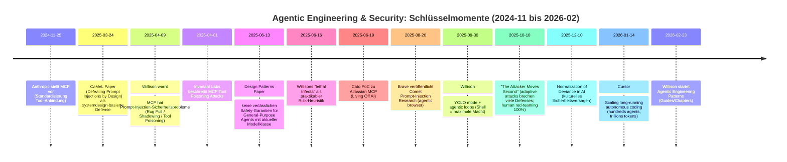

# Risiken, Failure Modes und Schadenspotenziale von Agentic Engineering mit AI‑Coding‑Agents

## Executive Summary

Agentic Engineering (im Sinne von Simon Willison) bezeichnet professionelles Software‑Engineering mit **Coding‑Agents**, die **Code nicht nur generieren, sondern auch ausführen**, testen und iterativ verbessern können – oft asynchron, teilweise parallelisiert und mit Tool‑/Shell‑Zugriff. [[Willison: Agentic Engineering](#src-willison-agentic)] [[Willison: Code Quality](#src-willison-code)]\
Die Kernthese, die sich durch Willisons jüngste Beiträge zieht, lautet: **Die Grenzkosten fürs “Code tippen” sinken dramatisch – die Kosten für „guten Code“ (Korrektheit, Tests, Sicherheit, Wartbarkeit, Dokumentation) bleiben hoch**. [[Willison: Code Quality](#src-willison-code)] Dadurch verschiebt sich das Risiko: nicht mehr „schaffen wir es überhaupt?“, sondern „schaffen wir es, die entstehenden Nebenwirkungen zu kontrollieren?“.

Die dominanten Negativaspekte (mit hoher Relevanz für AI‑Coding‑Agents) lassen sich evidenzbasiert so verdichten:

Erstens ist **Sicherheitsrisiko durch Prompt Injection / Confused‑Deputy‑Angriffe** der systemische Haupttreiber. Willison dokumentiert, dass Tool‑/Agent‑Systeme besonders dann kritisch werden, wenn **private Daten**, **untrusted Content** und **externe Kommunikationskanäle** zusammenkommen („lethal trifecta“). [[Willison: Lethal Trifecta](#src-willison-trifecta)] Externe Untersuchungen bestätigen konkrete, praxisnahe Angriffswege: Brave zeigt z. B. bei agentischen Browsern (Perplexity Comet) „indirect prompt injection“, die klassisches Browser‑Sicherheitsmodell (SOP/CORS) faktisch aushebelt, weil der Agent mit Nutzerprivilegien quer über Tabs/Domains handeln kann. [[Brave: Comet Prompt Injection](#src-brave)] [[Willison: Lethal Trifecta](#src-willison-trifecta)] OWASP klassifiziert Prompt Injection als Top‑Risiko (LLM01:2025) und betont, dass RAG/Fine‑Tuning das Problem nicht vollständig beseitigt. [[OWASP: LLM Top 10 2025](#src-owasp)]

Zweitens treiben viele Tools Nutzer in **„YOLO‑Modi“** (automatisches Durchwinken von Shell‑Commands / Tool‑Actions), weil Interaktiv‑Freigaben sonst Produktivität massiv bremsen. Willison nennt das explizit „inherently dangerous“ und listet konkrete Schadensbilder: Datenexfiltration, Zerstörung lokaler Artefakte, Missbrauch als Proxy für Angriffe. [[Willison: YOLO Mode](#src-willison-yolo)] Offizielle Doku bestätigt das Spannungsfeld: OpenAI nennt `--dangerously-bypass-approvals-and-sandbox` (Alias `--yolo`) „No sandbox; no approvals (not recommended)“; Anthropic empfiehlt „dangerous“ Modi nur im Container ohne Internet. [[OpenAI: Codex Docs](#src-openai-codex)] [[Willison: YOLO Mode](#src-willison-yolo)]

Drittens entstehen gravierende **Reproduzierbarkeits- und Verifikationsprobleme**, sobald Agenten „viel Output“ produzieren, aber belastbare Nachweise (grüne CI, reproduzierbare Builds, verifizierte Tests) fehlen. Das wird in der Diskussion um Cursor‑„Agent Swarms“ sichtbar: Cursor berichtet über >1 Mio. LoC in ~1 Woche für einen Browser‑Prototypen. [[Cursor: Agent Swarms Research](#src-cursor)] [[Willison: Async Agents](#src-willison-async)] Parallel dazu kritisiert eine unabhängige Analyse, dass daraus ohne klare Repro‑Marker leicht ein „Implied success“ wird (fehlende „known‑good revision“, CI‑Failing etc.). [[Kritik: Cursor Browser-Experiment](#src-cursor-critique)] Selbst wenn Willison später einen Build‑Erfolg nach README‑Update berichtet, bleibt das Muster: **Agentischer Output skaliert schneller als klassische Qualitätskontrolle**. [[Willison: Async Agents](#src-willison-async)]

Viertens wächst die **Supply‑Chain‑ und Tool‑Ecosystem‑Angriffsfläche**. MCP (Model Context Protocol) standardisiert Tool‑Anbindung, bringt aber neue Klassen von Missbrauch: „Tool Poisoning“ (versteckte Instruktionen in Tool‑Beschreibungen), Rug Pulls (nachträgliche Tool‑Mutation), Shadowing über mehrere Server. [[Willison: MCP Security](#src-willison-mcp)] [[Invariant Labs: Tool Poisoning](#src-invariant)] Diese Risiken sind konzeptionell verwandt mit Software‑Supply‑Chain‑Angriffen und werden inzwischen auch in OWASP‑Risiken (Supply Chain) systematisch adressiert. [[OWASP: LLM Top 10 2025](#src-owasp)] [[Invariant Labs: Tool Poisoning](#src-invariant)]

Fünftens sind **Governance- und Regulierungsfragen** offener als der Marketing‑Ton vieler Anbieter. Der EU‑AI‑Act (VO (EU) 2024/1689) ist in Kraft; Pflichten für General‑Purpose‑Model‑Provider werden ab 02.08.2025 wirksam und die EU‑Kommission hat dazu Guidelines/FAQs publiziert. [[EU AI Act](#src-eu-ai-act)] Für Unternehmen, die Agenten in reale Workflows bringen, bleibt die zentrale Lücke: **Wer haftet/prüft, wenn probabilistische Systeme reale Änderungen ausführen?** – genau die „Accountability“-Achse, die Willison als menschlichen Unterschiedspunkt herausstellt. [[Willison: Agentic Engineering](#src-willison-agentic)] [[Willison: Lethal Trifecta](#src-willison-trifecta)]

Die aggregierte Bewertung über alle Kategorien: Die kritischsten Risiken (hohe Schwere, hohe Wahrscheinlichkeit) liegen in **Prompt‑Injection‑getriebener Exfiltration/Tool‑Missbrauch**, **Autonomie/Control‑Loss durch YOLO‑Betrieb**, sowie **Supply‑Chain‑Kompromittierung über Tool‑Ökosysteme (MCP/Plugins)**. [[Willison: Lethal Trifecta](#src-willison-trifecta)] [[Willison: YOLO Mode](#src-willison-yolo)] [[Invariant Labs: Tool Poisoning](#src-invariant)] [[OWASP: LLM Top 10 2025](#src-owasp)]

## Vorgehen, Abgrenzung und Quellenqualität

Zeitraum: „letzte 2 Jahre“ operationalisiert als **24.02.2024 bis 24.02.2026** (heutiges Datum Europe/Berlin). Innerhalb dieses Fensters wurden auf simonwillison.net besonders die Tags/Serien rund um **coding‑agents**, **agentic‑engineering**, **prompt‑injection**, **model‑context‑protocol** und agentische Arbeitsweisen ausgewertet (u. a. Willisons neue **Agentic Engineering Patterns**‑Guides). [[Willison: Agentic Engineering](#src-willison-agentic)] [[Willison: Code Quality](#src-willison-code)] [[Willison: MCP Security](#src-willison-mcp)] [[Willison: Lethal Trifecta](#src-willison-trifecta)]

„Crawl“ im Sinne dieser Analyse: systematische Sichtung der relevanten Posts/Guides, Extraktion belastbarer Aussagen (Anekdoten, konkrete Befehle/Flags, Failure‑Stories, Sicherheitsargumente) und **Nachverfolgung zentraler Sublinks** zu Primär-/Offizialquellen (z. B. OpenAI‑Codex‑Docs, Anthropic‑Claude‑Code‑Docs, OWASP, NIST, arXiv‑Papers, Brave‑Security‑Research, Cato‑Threat‑Research, GitHub‑Security‑Advisories). [[OpenAI: Codex Docs](#src-openai-codex)] [[Anthropic: Claude Code Docs](#src-anthropic-docs)] [[OWASP: LLM Top 10 2025](#src-owasp)] [[NIST AI RMF: GenAI Profile](#src-nist)] [[Brave: Comet Prompt Injection](#src-brave)] [[Cato: Living Off AI](#src-cato)] [[GitHub Security Advisories](#src-github-docs)] [[arXiv: LLM Agent Security Design Patterns](#src-design-patterns)] [[arXiv: CaMeL](#src-camel)]

Quellenhierarchie (Priorität):\
Primär dominierten (a) **offizielle Dokumentation/Standards** (OpenAI, Anthropic, GitHub Docs, NIST, EU‑Kommission/EUR‑Lex, OWASP), (b) **Peer‑Review/Preprints** (arXiv), (c) **Security‑Research‑Teams** (Brave, Cato, Invariant Labs) und (d) **GitHub Security Advisories**. [[OpenAI: Codex Docs](#src-openai-codex)] [[Anthropic: Claude Code Docs](#src-anthropic-docs)] [[GitHub: Copilot Coding Agent](#src-github-copilot)] [[NIST AI RMF: GenAI Profile](#src-nist)] [[EU AI Act](#src-eu-ai-act)] [[Brave: Comet Prompt Injection](#src-brave)] [[Cato: Living Off AI](#src-cato)] [[GitHub Security Advisories](#src-github-docs)] [[Invariant Labs: Tool Poisoning](#src-invariant)]\
Wo Willison selbst spekulativ formuliert („ich weiß nicht, was ich empfehlen soll“), wird das im Risiko‑Katalog als Unsicherheit kenntlich gemacht und mit externer Evidenz (z. B. OWASP/NIST‑Risikokataloge, Angriffsstudien) kontrastiert. [[Willison: MCP Security](#src-willison-mcp)] [[OWASP: LLM Top 10 2025](#src-owasp)] [[NIST AI RMF: GenAI Profile](#src-nist)]

## Was Simon Willison unter Agentic Engineering versteht

Willison positioniert „Agentic Engineering“ als Gegenpol zu „Vibe Coding“: **professionelle Entwickler nutzen Coding‑Agents, um Expertise zu verstärken**, nicht um Code blind zu akzeptieren. [[Willison: Agentic Engineering](#src-willison-agentic)] Zentral ist dabei die Eigenschaft „generate + execute“: Agents können Code laufen lassen, testen, Fehler selbständig iterieren – und (entscheidend für Risiken) **Shell‑Commands/Tools ausführen**. [[Willison: Agentic Engineering](#src-willison-agentic)] [[Willison: YOLO Mode](#src-willison-yolo)]

Seine neuen „Agentic Engineering Patterns“ rahmen das Grundproblem: „Code ist billig, guter Code nicht“. Er definiert „guten Code“ explizit über Korrektheit, überprüfte Korrektheit (Tests), Minimalität, Error‑Handling, Wartbarkeit, Security‑„ilities“. [[Willison: Code Quality](#src-willison-code)] Daraus folgt ein negativer Systemeffekt: Wenn Organisationen die sinkenden Grenzkosten mit „mehr Output“ verwechseln, wachsen technische Schulden schneller als klassische Qualitätsmechanismen. [[Willison: Code Quality](#src-willison-code)] [[Willison: Lethal Trifecta](#src-willison-trifecta)]

Willison liefert außerdem eine sehr praktikable Agent‑Definition („tools in a loop to achieve a goal“). Diese Definition ist für Risikoanalyse entscheidend, weil sie die gefährliche Komponente benennt: **der Loop plus Tool‑Ausführung**. [[Willison: Agentic Engineering](#src-willison-agentic)] [[arXiv: LLM Agent Security Design Patterns](#src-design-patterns)]

Ein Schlüsselzitat (kurz) zur Gefahrenintuition ist Solomon Hykes’ zugespitzte Formulierung: „An AI agent is an LLM wrecking its environment in a loop.“ [[Willison: YOLO Mode](#src-willison-yolo)] Das ist weniger „Angstmache“ als eine Systemsicherheits‑Heuristik: sobald ein Modell _wirken_ kann (Shell, Netzwerk, Repo‑Writes), wird jede Fehlentscheidung oder jede adversariale Instruktion potenziell „konsequential“.

## Risiko-Katalog mit Severity/Likelihood und Mitigations

Nachfolgend die von dir gewünschten Dimensionen. Die Beispiele kombinieren jeweils (a) Simon‑Material und (b) mindestens eine externe, möglichst primäre Quelle.

### Technische Failure Modes

**Beschreibung:** Agenten produzieren fehlerhaften oder überdimensionierten Code, missverstehen Anforderungen, „driften“ in Nebenlösungen oder optimieren lokal statt systemisch. Parallelisierung kann Koordination zerbrechen (Locks, Deadlocks, fehlende Ownership), was in „Busywork“ statt Fortschritt endet. [[Cursor: Agent Swarms Research](#src-cursor)] [[Willison: Code Quality](#src-willison-code)] [[Willison: Async Agents](#src-willison-async)]

**Konkrete Beispiele:** Cursor beschreibt, dass eine flache Multi‑Agent‑Koordination mit Locks „in interesting ways“ scheiterte (Locks zu lange gehalten, nicht freigegeben, Updates ohne Lock), danach „risk‑averse“-Verhalten und „churning … without progress“. [[Cursor: Agent Swarms Research](#src-cursor)] Willison betont, dass ohne ausgeführte Tests AI‑Code „pure luck“ ist, ob er in Produktion funktioniert. [[Willison: Code Quality](#src-willison-code)]

**Schweregrad:** Mittel bis hoch (je nach Einsatzkritikalität; in Kernsystemen/Infra hoch).\
**Wahrscheinlichkeit:** Hoch (häufiges Normalverhalten bei unklaren Specs und fehlender Test‑Harness). [[Cursor: Agent Swarms Research](#src-cursor)] [[Willison: Code Quality](#src-willison-code)]

**Mitigation:** Testkultur als „Pflicht“ (TDD red/green, „first run the tests“) und CI‑„Gates“ als harte Stopps für Agent‑PRs. [[Willison: Code Quality](#src-willison-code)] Zusätzlich Rollen-/Pipeline‑Design statt „Agenten‑Anarchie“ (Planner/Worker/Judge) – aber mit expliziter Qualitätsinstanz, die nicht selbst zum Bottleneck wird. [[Cursor: Agent Swarms Research](#src-cursor)]

**Offene Forschungsfragen:** Wie misst man „Fortschritt“ jenseits LoC/Commits? Wie verhindert man systematischen „Drift“ über lange Runs ohne permanenten menschlichen Eingriff? [[Cursor: Agent Swarms Research](#src-cursor)] [[NIST AI RMF: GenAI Profile](#src-nist)]

### Security und Vulnerability-Risiken

**Beschreibung:** Agenten sind besonders anfällig für **Prompt Injection** (direkt/indirekt) und werden zu „Confused Deputies“, sobald untrusted Content in denselben Kontext wie privilegierte Tool‑Calls gelangt. [[Willison: MCP Security](#src-willison-mcp)] [[OWASP: LLM Top 10 2025](#src-owasp)] [[arXiv: LLM Agent Security Design Patterns](#src-design-patterns)]

**Konkrete Beispiele:**\
MCP‑Ökosystem: Willison zeigt „tool poisoning“ als versteckte Instruktionen in Tool‑Descriptions (für User unsichtbar, für LLM sichtbar), die den Agenten dazu bringen, sensible Dateien zu lesen und zu exfiltrieren. [[Willison: MCP Security](#src-willison-mcp)] [[Invariant Labs: Tool Poisoning](#src-invariant)]\
Agentic Browser: Brave demonstriert, dass Comet Web‑Content direkt ins LLM füttert, wodurch versteckte Instruktionen Cross‑Tab Aktionen auslösen können (z. B. Zugriff auf E‑Mail/OTP und Exfiltration über Antwort). [[Brave: Comet Prompt Injection](#src-brave)] [[Willison: Lethal Trifecta](#src-willison-trifecta)]\
Enterprise‑Workflow: Cato beschreibt eine PoC‑Kette gegen Atlassian MCP/Jira Service Management, bei der ein externer Ticket‑Autor via Prompt Injection interne Daten exfiltrieren kann („Living Off AI“). [[Cato: Living Off AI](#src-cato)]

**Schweregrad:** Hoch (Datenabfluss, unautorisierte Aktionen, laterale Bewegung).\
**Wahrscheinlichkeit:** Hoch (OWASP bewertet Prompt Injection als Top‑Risiko; „agency“ erhöht Impact). [[OWASP: LLM Top 10 2025](#src-owasp)] [[arXiv: LLM Agent Security Design Patterns](#src-design-patterns)]

**Mitigation:**\
Systemdesign statt „noch mehr AI“: CaMeL (Capabilities + kontrollierte Datenflüsse) und Design‑Pattern‑Katalog (z. B. Plan‑Then‑Execute, Context Minimization) sind aktuell die stärksten akademischen Richtungen. [[arXiv: CaMeL](#src-camel)] [[arXiv: LLM Agent Security Design Patterns](#src-design-patterns)] [[Willison: MCP Analysis](#src-willison-mcp)]\
Hardening in Produktdoku: konsequentes Human‑in‑the‑Loop, klare Tool‑Invocation UI, strikte Trennung „trusted user instruction“ vs „untrusted content“. [[Willison: MCP Security](#src-willison-mcp)] [[Brave: Comet Prompt Injection](#src-brave)] [[Invariant Labs: Tool Poisoning](#src-invariant)]

**Offene Forschungsfragen:** Gibt es praktikable „provable guarantees“ in General‑Purpose‑Agents? Die Design‑Patterns‑Autoren bezweifeln das ausdrücklich für die aktuelle Modellklasse. [[arXiv: LLM Agent Security Design Patterns](#src-design-patterns)]

### Autonomie, Kontrollverlust und „YOLO“-Betrieb

**Beschreibung:** Produktivitätsdruck führt zu „Auto‑Approve“/„Danger“-Konfigurationen, in denen Agenten ohne Freigaben schreiben/exekutieren. Damit werden sie faktisch zu hochprivilegierten Insidern (mit schlechter Vorhersagbarkeit). [[Willison: YOLO Mode](#src-willison-yolo)] [[OpenAI: Codex Docs](#src-openai-codex)] [[Cursor: Agent Swarms Research](#src-cursor)]

**Konkrete Beispiele:** Willison beschreibt „YOLO mode“ als gleichzeitig „key to productivity“ und „so dangerous“, inkl. Risiko‑Trias: (1) destructive commands, (2) Exfiltration von Files/Env‑Secrets, (3) Proxy‑Missbrauch für Angriffe. [[Willison: YOLO Mode](#src-willison-yolo)] Offizielle Doku: OpenAI benennt `--dangerously-bypass-approvals-and-sandbox` als „No sandbox; no approvals“ und warnt explizit. [[OpenAI: Codex Docs](#src-openai-codex)] Anthropic empfiehlt „dangerous“ nur im Container ohne Internet, um Datenverlust/Exfiltration zu minimieren. [[Willison: YOLO Mode](#src-willison-yolo)]

**Schweregrad:** Hoch (weil Ausführungskompetenz = reale Schadensfähigkeit).\
**Wahrscheinlichkeit:** Mittel bis hoch (weil Nutzer/Teams Produktivität priorisieren; „Normalization of Deviance“). [[Willison: Lethal Trifecta](#src-willison-trifecta)] [[Willison: Agentic Engineering](#src-willison-agentic)] [[OpenAI: Codex Docs](#src-openai-codex)]

**Mitigation:**\
Isolationsprinzip: Agenten in getrennten, ephemeren Umgebungen (Codespaces/CI‑Runner/Container) laufen lassen, Internet sperren oder streng allowlisten. [[Willison: YOLO Mode](#src-willison-yolo)] [[OpenAI: Codex Docs](#src-openai-codex)]\
Credential‑Scoping: nur Staging‑Keys, Budget‑Caps, minimale Rechte. [[Willison: YOLO Mode](#src-willison-yolo)]\
Kulturell: „Danger flags“ als Ausnahme, Audit‑pflichtig, nicht als Default.

**Offene Forschungsfragen:** Wie kann man „Least Privilege“ für natürlichsprachliche Tool‑Loops ergonomisch machen (ohne User‑Fatigue)? CaMeL diskutiert die „user burden“ explizit. [[arXiv: CaMeL](#src-camel)]

### Reproduzierbarkeit, Verifikation und „Beweislast“-Umkehr

**Beschreibung:** Agenten können schnell PRs und Millionen LoC produzieren; ohne strikte Verifikationsartefakte (deterministische Builds, Testnachweise, reproduzierbare Benchmarks) entsteht eine Beweislast‑Umkehr: Reviewer sollen nachträglich verifizieren, was der Agent behauptet. [[Willison: Code Quality](#src-willison-code)] [[Cursor: Agent Swarms Research](#src-cursor)]

**Konkrete Beispiele:** Cursor berichtet über agentisches „browser from scratch“ (>1 Mio. LoC) und „trillions of tokens“. [[Cursor: Agent Swarms Research](#src-cursor)] Eine unabhängige Kritik moniert fehlende eindeutige Evidenz/„known‑good revision“ und dass enorme Output‑Mengen keine funktionierende Software garantieren. [[Kritik: Cursor Browser-Experiment](#src-cursor-critique)] Willison setzt dem Pattern‑Gegenmaßnahmen entgegen: Tests sind „no longer optional“; ohne Ausführung sind Ergebnisse Glück. [[Willison: Code Quality](#src-willison-code)]

**Schweregrad:** Mittel (kann aber hoch werden bei Safety‑/Security‑relevanter Software).\
**Wahrscheinlichkeit:** Hoch (insb. bei Async‑Agents, Parallelisierung, Zeitdruck). [[Willison: Async Agents](#src-willison-async)] [[Cursor: Agent Swarms Research](#src-cursor)]

**Mitigation:**\
„Executable evidence“ verpflichtend: CI‑Reports, reproduzierbare Build‑Anleitung, Benchmarks, pinned environments.\
Agent‑Logs/Tracing: GitHub Copilot Coding Agent betont Transparenz (Session Logs) und Security‑Scans (CodeQL, Secret Scanning, Dependency Checks). [[GitHub: Copilot Coding Agent](#src-github-copilot)]

**Offene Forschungsfragen:** Welche minimalen „reproducibility markers“ sollten agentische Output‑Projekte standardmäßig liefern (vergleichbar zu wissenschaftlichen Artefakt‑Standards)? [[Kritik: Cursor Browser-Experiment](#src-cursor-critique)] [[NIST AI RMF: GenAI Profile](#src-nist)]

### Ökonomische und soziale Schäden

**Beschreibung:** Agentic Engineering verändert Arbeitsorganisation: Aufgaben werden zerlegt, parallelisiert, stärker überwacht (Logs/Audits), und es drohen Deskilling‑Effekte (weniger tiefes Codeverständnis bei Routinearbeiten). Gleichzeitig verschieben sich Jobprofile und Produktivitätsgewinne können Ungleichheit verstärken. [[Willison: Async Agents](#src-willison-async)] [[IMF/ILO: AI & Labour](#src-imf-ilo)] [[ILO: GenAI Berufsexposition](#src-ilo)]

**Konkrete Beispiele:** Jules wirbt explizit mit massiv paralleler Abarbeitung („60 concurrent tasks“ in Ultra‑Plan) – ein Hinweis auf Organisationswandel hin zu „Agent‑Throughput‑Management“. [[Google: Jules](#src-jules)] ILO quantifiziert/aktualisiert die **Berufsexposition gegenüber GenAI** und weist auf Veränderungen in Aufgabenprofilen (Tasks) hin. [[ILO: GenAI Berufsexposition](#src-ilo)]

**Schweregrad:** Mittel (gesamtgesellschaftlich potenziell hoch, aber schwer zurechenbar).\
**Wahrscheinlichkeit:** Hoch (breite Tool‑Adoption, niedrige Grenzkosten, Management‑Anreize). [[Google: Jules](#src-jules)] [[ILO: GenAI Berufsexposition](#src-ilo)]

**Mitigation:**\
Upskilling‑Programme und neue Rollen („Agent Operator“, „Agent QA/Security Reviewer“).\
Messgrößen weg von LoC/Velocity hin zu Quality/Safety KPIs.\
Sozialpolitisch: ILO/IMF diskutieren flankierende Maßnahmen (Qualifizierung, Absicherung, steuerliche Ausgleichsinstrumente) – hier als Kontext für Unternehmensrisiko. [[ILO: GenAI Berufsexposition](#src-ilo)] [[IMF/ILO: AI & Labour](#src-imf-ilo)]

**Offene Forschungsfragen:** Welche Tätigkeiten werden substituiert vs. augmentiert – und wie designen wir Organisationsstrukturen, die Qualität vor Output priorisieren? [[ILO: GenAI Berufsexposition](#src-ilo)] [[Willison: Lethal Trifecta](#src-willison-trifecta)]

### Rechtliche und regulatorische Lücken

**Beschreibung:** Die EU reguliert AI risikobasiert; für General‑Purpose‑Modelle existieren spezifische Pflichten und Guidelines. Dennoch bleibt in der Praxis unklar, wie Agent‑Systeme über Tool‑Ökosysteme (MCP, Plugins, „bring your own tools“) sauber in Verantwortlichkeiten und Compliance‑Nachweise übersetzt werden. [[EU AI Act](#src-eu-ai-act)]

**Konkrete Beispiele:** EU‑Kommission erläutert Pflichten für GPAI‑Provider und verweist auf Code‑of‑Practice‑Mechaniken, die Compliance operationalisieren sollen; diese Pflichten gelten zeitlich gestaffelt (GPAI‑Obligationen ab 02.08.2025). [[EU AI Act](#src-eu-ai-act)] Parallel werben Anbieter (z. B. Atlassian Remote MCP Server) mit „secure … within permissioned boundaries“, während Security‑Research (Cato) zeigt, dass Prompt‑Injection‑Designmuster solche Zusicherungen unterminieren können. [[Cato: Living Off AI](#src-cato)]

**Schweregrad:** Mittel bis hoch (Bußgelder/Haftung/Reputationsschaden je nach Einsatz).\
**Wahrscheinlichkeit:** Mittel (abhängig von Branche, EU‑Exposure, Audit‑Reife).

**Mitigation:**\
„Compliance by architecture“: Tool‑/Data‑Flow‑Kontrollen (Capabilities, Policy Enforcement), Audit‑Logs, klare Freigabepfade. [[arXiv: CaMeL](#src-camel)] [[NIST AI RMF: GenAI Profile](#src-nist)]\
Lieferketten‑Governance: Zulassungsprozesse für MCP‑Server/Plugins, Version Pinning, Change Notifications. [[Invariant Labs: Tool Poisoning](#src-invariant)] [[Willison: MCP Security](#src-willison-mcp)]

**Offene Forschungsfragen:** Wie werden Agenten als „Systeme“ bewertet, wenn sie dynamisch Tools und Kontexte kombinieren? Wie standardisiert man Nachweise für „human in the loop“ und Policy‑Enforcement? [[Invariant Labs: Tool Poisoning](#src-invariant)] [[EU AI Act](#src-eu-ai-act)]

### Ethische Risiken und Verantwortlichkeit

**Beschreibung:** Agenten wirken „kompetent“, bleiben aber probabilistisch/nicht‑deterministisch. Organisationen können daraus eine gefährliche Routine ableiten: „hat bisher funktioniert“ → Standards werden gesenkt („Normalization of Deviance“). [[Willison: Lethal Trifecta](#src-willison-trifecta)] [[NIST AI RMF: GenAI Profile](#src-nist)]

**Konkrete Beispiele:** Willison zitiert Johann Rehberger sinngemäß, dass Vendoren probabilistische Outputs wie deterministische Systeme behandeln – und dadurch mehr consequential actions ohne robuste Sicherheit zulassen. [[Willison: Lethal Trifecta](#src-willison-trifecta)] Er betont außerdem „Accountability“ als menschlichen Vorteil: AI‑Agenten können keine Verantwortung übernehmen oder „lernen“ im Sinne von Konsequenz‑Tragen. [[Willison: Agentic Engineering](#src-willison-agentic)] NISTs Generative‑AI‑Profil ist als Governance‑Rahmen explizit darauf angelegt, GenAI‑spezifische Risiken (inkl. Zuverlässigkeit/Fehler/Missbrauch) systematisch zu managen. [[NIST AI RMF: GenAI Profile](#src-nist)]

**Schweregrad:** Mittel bis hoch (erzeugt „Systeme, die niemand mehr versteht und niemand mehr stoppt“).\
**Wahrscheinlichkeit:** Hoch (organisatorischer Pfadabhängigkeitseffekt). [[Willison: Lethal Trifecta](#src-willison-trifecta)] [[OpenAI: Codex Docs](#src-openai-codex)]

**Mitigation:**\
„Ethics as process“: unabhängige Reviews, Trennung von Ersteller/Approver (GitHub Copilot Coding Agent erzwingt z. B. unabhängige Approval‑Pfadlogik und verhindert Selbst‑Approval). [[GitHub: Copilot Coding Agent](#src-github-copilot)]\
Anti‑Automation‑Bias: Defaults eher sicher, „danger“ opt‑in und auditierbar.

**Offene Forschungsfragen:** Wie misst man „Over‑trust“ und senkt ihn ohne Produktivität zu zerstören? Wie designt man UI/UX gegen „user fatigue“ (ständige Prompts) ohne in YOLO zu kippen? [[arXiv: CaMeL](#src-camel)] [[OWASP: LLM Top 10 2025](#src-owasp)]

### Misuse, Dual-Use und Angriffe „durch Skalierung“

**Beschreibung:** Agenten sind Dual‑Use‑Multiplikatoren: Sie können legitime Wartung automatisieren, aber ebenso Exploit‑Chains skalieren (Recon, Code‑Modifikationen, Infrastruktur‑Missbrauch). Die besondere Gefahr ist Geschwindigkeit + Parallelität. [[Willison: YOLO Mode](#src-willison-yolo)] [[Cursor: Agent Swarms Research](#src-cursor)] [[OWASP: LLM Top 10 2025](#src-owasp)]

**Konkrete Beispiele:** Willison nennt als YOLO‑Risiko explizit „use your machine as a proxy … for other hacking attacks“. [[Willison: YOLO Mode](#src-willison-yolo)] Cato beschreibt laterale Bewegung über prompt‑injizierte enterprise Workflows als plausible Next‑Stage. [[Cato: Living Off AI](#src-cato)] Cursor zeigt „hundreds of concurrent agents“ als erreichbare Größenordnung – das ist für Angreifer ein offensichtlicher Hebel. [[Cursor: Agent Swarms Research](#src-cursor)]

**Schweregrad:** Hoch.\
**Wahrscheinlichkeit:** Mittel (abhängig von Exposure und Schutzmaßnahmen; bei Internet‑Access hoch). [[OpenAI: Codex Docs](#src-openai-codex)] [[Brave: Comet Prompt Injection](#src-brave)]

**Mitigation:**\
Network egress control, sandboxing, SAST/DAST/secret scans, Abuse‑Monitoring (EDR‑ähnliche Kontrolle in Agent‑Runtimes; als Idee auch in Security‑Diskussionen zu Agenten präsent). [[OpenAI: Codex Docs](#src-openai-codex)] [[GitHub: Copilot Coding Agent](#src-github-copilot)] [[Cato: Living Off AI](#src-cato)]

**Offene Forschungsfragen:** Wie „rate‑limitiert“ man agentisches Handeln sinnvoll (actions/min, domains, data‑volume), ohne legitime Arbeit zu blockieren? [[OWASP: LLM Top 10 2025](#src-owasp)] [[NIST AI RMF: GenAI Profile](#src-nist)]

### Emergent Behaviors und Alignment-Illusionen

**Beschreibung:** In Multi‑Agent‑Systemen entstehen emergente Koordinationsfehler (lock contention, „risk aversion“, Zielverschiebung, Tunnel‑Vision). Außerdem kann „alignment“ wie eine UI‑Illusion wirken: der Agent scheint im Rahmen zu handeln, exfiltriert aber über Side‑Channels (Base64, versteckte Felder). [[Cursor: Agent Swarms Research](#src-cursor)] [[Willison: MCP Security](#src-willison-mcp)] [[Invariant Labs: Tool Poisoning](#src-invariant)]

**Konkrete Beispiele:** Cursor beschreibt „risk‑averse“ emergentes Verhalten bei fehlender Hierarchie. [[Cursor: Agent Swarms Research](#src-cursor)] MCP Tool Poisoning zeigt „disconnect between what the user sees and what the AI model does“, inkl. versteckter Tool‑Argumente und Exfiltration. [[Invariant Labs: Tool Poisoning](#src-invariant)] OWASP betont, dass Injection nicht menschenlesbar sein muss (z. B. in Bildern/Hidden Tokens). [[OWASP: LLM Top 10 2025](#src-owasp)] [[Brave: Comet Prompt Injection](#src-brave)]

**Schweregrad:** Mittel bis hoch (bei sicherheitskritischen Tools hoch).\
**Wahrscheinlichkeit:** Mittel (steigt mit Tool‑Komplexität und Multi‑Agent‑Skalierung). [[Cursor: Agent Swarms Research](#src-cursor)] [[Invariant Labs: Tool Poisoning](#src-invariant)]

**Mitigation:**\
„Coloring“/Taint‑Tracking‑Denken: Trennung untrusted/trusted Inputs; dynamische Policy‑Checks (MCP Colors als Praxisheuristik). [[Willison: MCP Analysis](#src-willison-mcp)] [[arXiv: CaMeL](#src-camel)]\
Multi‑Agent‑Sicherheitsmodelle: isolierte Sub‑Agents ohne Tool‑Access für untrusted Content (Design Patterns, Dual‑LLM, Map‑Reduce‑Pattern). [[arXiv: LLM Agent Security Design Patterns](#src-design-patterns)] [[Willison: MCP Analysis](#src-willison-mcp)]

**Offene Forschungsfragen:** Wie formalisiert man agentische Koordination + Security (Control‑Flow‑Integrity für Tool‑Loops) so, dass Angreifer mit adaptiven Strategien nicht einfach „second‑move“ gewinnen? [[arXiv: The Attacker Moves Second](#src-attacker)] [[arXiv: LLM Agent Security Design Patterns](#src-design-patterns)]

### Skalierungsrisiken: Token, Kosten, Energie, Governance

**Beschreibung:** Agentisches Scaling erhöht nicht linear den Nutzen; es erhöht fast sicher die **Angriffsfläche**, die **Kosten** (Token/Compute), und die **Governance‑Komplexität** (mehr Sessions, mehr PRs, mehr Artefakte). [[Cursor: Agent Swarms Research](#src-cursor)] [[Willison: Async Agents](#src-willison-async)] [[IMF/ILO: AI & Labour](#src-imf-ilo)]

**Konkrete Beispiele:** Cursor berichtet „trillions of tokens“ und wochenlange Agent‑Runs. [[Cursor: Agent Swarms Research](#src-cursor)] Willison beschreibt „parallel agents“ als Verstärker der „code is cheap“‑Dynamik. [[Willison: Code Quality](#src-willison-code)] [[Willison: Async Agents](#src-willison-async)] IMF/öffentliche Debatte verweist auf Energie-/Emissions‑Externalitäten von AI‑Compute als gesellschaftliches Risiko (hier als Kontext für „scaling harms“). [[IMF/ILO: AI & Labour](#src-imf-ilo)]

**Schweregrad:** Mittel (Kosten/CO₂) bis hoch (wenn Scaling Security/Quality überrollt).\
**Wahrscheinlichkeit:** Hoch (Skalierung ist Kern‑Value‑Prop vieler Anbieter). [[Google: Jules](#src-jules)] [[Cursor: Agent Swarms Research](#src-cursor)]

**Mitigation:**\
Token‑Budgetierung, „stop conditions“, automatische Abbruchkriterien bei Nicht‑Fortschritt, CI‑gesteuerte „quality gates“, und vor allem: Bewertung nach Outcomes statt Output. [[Cursor: Agent Swarms Research](#src-cursor)] [[Willison: Code Quality](#src-willison-code)] [[GitHub: Copilot Coding Agent](#src-github-copilot)]

**Offene Forschungsfragen:** Wie optimiert man Multi‑Agent‑Systeme für „useful work per token“ unter Sicherheitsconstraints? [[Cursor: Agent Swarms Research](#src-cursor)] [[NIST AI RMF: GenAI Profile](#src-nist)]

### Supply-Chain- und Dependency-Risiken

**Beschreibung:** Agenten installieren Dependencies, binden Tools an, und konsumieren Tool‑Beschreibungen als „Code“. Jede dieser Kanten ist Supply‑Chain‑Angriffsfläche (malicious MCP server, kompromittierte Packages, Rug Pulls). [[Invariant Labs: Tool Poisoning](#src-invariant)] [[Willison: YOLO Mode](#src-willison-yolo)] [[OWASP: LLM Top 10 2025](#src-owasp)]

**Konkrete Beispiele:** Invariant Labs zeigt, dass MCP‑Tool‑Descriptions selbst ein Angriffsvektor sind („Tool Poisoning Attack“), inkl. Shadowing und Rug Pulls. [[Invariant Labs: Tool Poisoning](#src-invariant)] [[Willison: MCP Security](#src-willison-mcp)] Willison warnt, dass „zu viele MCP Server“ zusätzlich massiv Tokens fressen und LLM‑Leistung verschlechtern können, wodurch Nutzer zu simpleren (aber nicht unbedingt sichereren) Workarounds greifen (CLI‑Tools). [[Willison: MCP Analysis](#src-willison-mcp)] OWASP führt Supply Chain als eigenes Top‑Risiko (LLM03:2025). [[OWASP: LLM Top 10 2025](#src-owasp)]

**Schweregrad:** Hoch (Kompromittierung -> persistente Kontrolle).\
**Wahrscheinlichkeit:** Mittel bis hoch (Ökosystem wächst schnell; Plugin‑Incentives). [[Invariant Labs: Tool Poisoning](#src-invariant)] [[Willison: MCP Analysis](#src-willison-mcp)]

**Mitigation:**\
Tool‑Pinning (Hashes/Checksums), Signaturen, Change‑Alerts, isolierte Tool‑Scopes, minimaler MCP‑Footprint und „trusted tool registry“. [[Invariant Labs: Tool Poisoning](#src-invariant)] [[Willison: MCP Security](#src-willison-mcp)] [[GitHub: Copilot Coding Agent](#src-github-copilot)]

**Offene Forschungsfragen:** Wie standardisiert man „AIBOM“/Tool‑SBOM für Agent‑Ökosysteme (MCP‑Server, Prompt‑Assets, Policies) so, dass Auditierbarkeit real wird? [[OWASP: LLM Top 10 2025](#src-owasp)] [[NIST AI RMF: GenAI Profile](#src-nist)]

## Vergleich konkreter Agentic‑Systeme/Tools aus dem Korpus

| Tool/System                                   | Quelle                                                                                                                                                | Kern‑Capabilities                                                                                                                                        | Bekannte Incidents/Risiken (Beispiele)                                                                                                                                                                                                       | Mitigation‑Status (aus Quellenlage)                                                                                                                                                                                                       |
| --------------------------------------------- | ----------------------------------------------------------------------------------------------------------------------------------------------------- | -------------------------------------------------------------------------------------------------------------------------------------------------------- | -------------------------------------------------------------------------------------------------------------------------------------------------------------------------------------------------------------------------------------------- | ----------------------------------------------------------------------------------------------------------------------------------------------------------------------------------------------------------------------------------------- |
| OpenAI **Codex CLI**                          | OpenAI Codex Docs + Security/CLI‑Flags [[OpenAI: Codex Docs](#src-openai-codex)]                                                                      | Lokaler Agent: liest/editiert Files, führt Commands aus, `codex exec` für CI/Automation [[OpenAI: Codex Docs](#src-openai-codex)]                        | „YOLO“ via `--dangerously-bypass-approvals-and-sandbox` (alias `--yolo`) = No sandbox/No approvals [[OpenAI: Codex Docs](#src-openai-codex)] [[Willison: Agentic Engineering](#src-willison-agentic)]                                        | Doku bietet Sandbox‑/Approval‑Kombinationen und Protected Paths; warnt vor YOLO; empfiehlt kontrollierte Umgebungen [[OpenAI: Codex Docs](#src-openai-codex)]                                                                             |
| OpenAI **Codex Web / Cloud**                  | Erwähnung als Async Agent in Willison + OpenAI Codex‑Umfeld [[Willison: Async Agents](#src-willison-async)] [[OpenAI: Codex Docs](#src-openai-codex)] | Asynchron: arbeitet serverseitig, PR‑basiert (fire‑and‑forget) [[Willison: Async Agents](#src-willison-async)]                                           | Prompt‑Injection + Netzwerkzugang = Exfil/Proxy‑Risiko (Willisons „lethal trifecta“‑Warnung) [[Willison: Async Agents](#src-willison-async)] [[Willison: Lethal Trifecta](#src-willison-trifecta)]                                           | Standardmäßig eher restriktive Umgebungen laut Willison; bleibt abhängig von Netzwerk-/Tool‑Policy [[Willison: Async Agents](#src-willison-async)] [[OpenAI: Codex Docs](#src-openai-codex)]                                              |
| Anthropic **Claude Code**                     | Claude Code Docs [[Anthropic: Claude Code Docs](#src-anthropic-docs)]                                                                                 | Agentic coding: read/edit/run commands, IDE/terminal/web; Teams/SDK möglich [[Anthropic: Claude Code Docs](#src-anthropic-docs)]                         | „YOLO“/Skip‑Permissions erhöht Datenverlust/Exfil‑Risiko; Willison nutzt `--dangerously-skip-permissions` „habit“ [[Willison: Agentic Engineering](#src-willison-agentic)] [[Willison: YOLO Mode](#src-willison-yolo)]                       | Anthropic empfiehlt „dangerous“ nur in Container ohne Internet + Reference Implementation [[Willison: YOLO Mode](#src-willison-yolo)] [[Anthropic: Claude Code Docs](#src-anthropic-docs)]                                                |
| Anthropic **Claude Code for web**             | Willison‑Post [[Willison: Async Agents](#src-willison-async)]                                                                                         | Async Agent: Repo klonen, Container, queued prompts, Branch/PR Erstellung [[Willison: Async Agents](#src-willison-async)]                                | PRs „indistinguishable“ von CLI; Gefahr: unklare Sandbox‑Dokumentation/Trust; potentiell weitreichende Repo‑Writes [[Willison: Async Agents](#src-willison-async)] [[Willison: YOLO Mode](#src-willison-yolo)]                               | Angeblich Container‑basiert; Netzwerk‑Restriktionen wählbar (allowlist/*) – aber Wirksamkeit hängt von Umsetzung ab [[Willison: Async Agents](#src-willison-async)] [[Willison: YOLO Mode](#src-willison-yolo)]                           |
| Anthropic **Claude Cowork**                   | Willison‑Eindruck [[Willison: Agentic Engineering](#src-willison-agentic)]                                                                            | General Agent (breiter als Coding), mit Sandbox‑Defaults [[Willison: Agentic Engineering](#src-willison-agentic)]                                        | Willison betont: keine Garantien gegen Prompt Injection; „high profile incident“ nötig, damit ernstgenommen [[Willison: Agentic Engineering](#src-willison-agentic)] [[Willison: Lethal Trifecta](#src-willison-trifecta)]                   | Default‑Sandbox hilft, aber „guarantees“ fehlen; Risiko bleibt bei untrusted content + actions [[Willison: Agentic Engineering](#src-willison-agentic)] [[arXiv: LLM Agent Security Design Patterns](#src-design-patterns)]               |
| GitHub **Copilot Coding Agent**               | GitHub Docs [[GitHub: Copilot Coding Agent](#src-github-copilot)]                                                                                     | Background‑Agent: PR‑Workflow, ephemere Env (GitHub Actions), Tests/Lint; Iteration via PR reviews [[GitHub: Copilot Coding Agent](#src-github-copilot)] | Prompt Injection via Issues/Comments; Zugriff auf sens. Infos; kann Code pushen [[GitHub: Copilot Coding Agent](#src-github-copilot)]                                                                                                        | Built‑in Protections: Branch‑Beschränkung, Workflow‑Gating, CodeQL/Secret Scan/Dependency Checks, Firewall‑Internet‑Kontrolle; Prompt‑Injection‑Mitigation u. a. Hidden‑Char‑Filter [[GitHub: Copilot Coding Agent](#src-github-copilot)] |
| Google **Jules**                              | Jules Landing Page [[Google: Jules](#src-jules)]                                                                                                      | Asynchron: Repo auf Cloud VM, Plan + Diff + PR; massiv parallel (bis 60 concurrent) [[Google: Jules](#src-jules)]                                        | Hohe Parallelität verstärkt Review‑/Governance‑Risiken; Cloud‑VM als zusätzlicher Trust‑Layer [[Google: Jules](#src-jules)] [[Cursor: Agent Swarms Research](#src-cursor)]                                                                   | Öffentliche Seite beschreibt Workflow, aber keine tiefen Security‑Details; Risikoabschätzung abhängig von Enterprise‑Controls [[Google: Jules](#src-jules)]                                                                               |
| Cursor **Agent Swarms / Long‑running coding** | Cursor Research Post [[Cursor: Agent Swarms Research](#src-cursor)]                                                                                   | Hunderte Agenten, Wochenläufe, Planner/Worker/Judge; schreibt „trillions of tokens“ [[Cursor: Agent Swarms Research](#src-cursor)]                       | Emergent failures (locks, brittleness, risk‑aversion, drift). Repro/„implied success“‑Debatte um Browser‑Experiment [[Cursor: Agent Swarms Research](#src-cursor)] [[Kritik: Cursor Browser-Experiment](#src-cursor-critique)]               | Forschungspost diskutiert Koordination; externe Kritik fordert strengere Repro‑Belege; Governance bleibt offene Baustelle [[Kritik: Cursor Browser-Experiment](#src-cursor-critique)] [[Cursor: Agent Swarms Research](#src-cursor)]      |
| **Model Context Protocol (MCP)**              | Anthropic MCP‑Einführung + Spec + Willison‑Kritik [[Willison: MCP Analysis](#src-willison-mcp)] [[Invariant Labs: Tool Poisoning](#src-invariant)]    | Standardisierte Tool/Resource/Prompt‑Interfaces (Plugin‑ähnlich) [[Willison: MCP Analysis](#src-willison-mcp)]                                           | Tool Poisoning, Rug Pull, Cross‑Server Shadowing; „insecure by design“ bei lethal‑trifecta‑Kombinationen [[Willison: MCP Security](#src-willison-mcp)] [[Invariant Labs: Tool Poisoning](#src-invariant)] [[Cato: Living Off AI](#src-cato)] | Spec empfiehlt Human‑in‑the‑Loop („SHOULD“); Praxis zeigt große Lücken; Bedarf an Pinning/UI‑Transparenz/Dataflow‑Controls [[Willison: MCP Security](#src-willison-mcp)] [[Invariant Labs: Tool Poisoning](#src-invariant)]               |
| Perplexity **Comet** (agentischer Browser)    | Brave Security Research [[Brave: Comet Prompt Injection](#src-brave)]                                                                                 | Browser‑Agent: Webseiten zusammenfassen und handeln; Cross‑Tab Aktionen möglich [[Brave: Comet Prompt Injection](#src-brave)]                            | Indirect prompt injection kann E‑Mail/OTP exfiltrieren; traditionelle Web‑Sicherheitsannahmen brechen [[Brave: Comet Prompt Injection](#src-brave)]                                                                                          | Brave listet Mitigations (Separation trusted/untrusted, Alignment‑Checks, user interaction for sensitive actions, Isolation agentic mode) [[Brave: Comet Prompt Injection](#src-brave)]                                                   |

## Timeline zentraler Entwicklungen im Zeitraum

## Präsentationsoutline mit Speaker Notes

**Titel-Slide:**\
_„Agentic Engineering mit AI‑Coding‑Agents: Risiken, Failure Modes und Schadenspotenziale (2024–2026 Evidenzlage)“_\
Speaker Notes:

- Definition: „tools in a loop“ + „generate & execute“ als Risikokern [[Willison: Agentic Engineering](#src-willison-agentic)]
- Fokus heute: negative Aspekte + Mitigations

**Slide:** _Warum Agentic Engineering anders gefährlich ist als „normale“ Code‑Assistenz_\
Speaker Notes:

- Tool‑Loop macht Modelle „konsequential“ (Shell/API/Repo‑Writes) [[Willison: YOLO Mode](#src-willison-yolo)] [[arXiv: LLM Agent Security Design Patterns](#src-design-patterns)]
- Grenzkosten Output ↓, Kosten „guter Code“ bleiben [[Willison: Code Quality](#src-willison-code)]

**Slide:** _Die lethal trifecta als Risikoheuristik_\
Speaker Notes:

- Private data + untrusted content + external comms = Exfil‑Designmuster [[Willison: Lethal Trifecta](#src-willison-trifecta)] [[Cato: Living Off AI](#src-cato)]
- Warum Guardrails keine Garantien liefern [[Willison: Lethal Trifecta](#src-willison-trifecta)] [[arXiv: LLM Agent Security Design Patterns](#src-design-patterns)]

**Slide:** _Prompt Injection in the wild (Browser/Enterprise/Tools)_\
Speaker Notes:

- Brave: Comet indirect injection → Cross‑Tab E‑Mail/OTP Exfil [[Brave: Comet Prompt Injection](#src-brave)]
- Cato: Atlassian MCP/JSM „Living Off AI“ PoC [[Cato: Living Off AI](#src-cato)]

**Slide:** _MCP/Tool‑Ökosystem: Tool Poisoning, Rug Pulls, Shadowing_\
Speaker Notes:

- Invariant Labs: Tool‑Descriptions als Angriffsfläche [[Invariant Labs: Tool Poisoning](#src-invariant)]
- Willison: „think carefully about what you install“ + Human‑in‑the‑loop SHOULD→MUST [[Willison: MCP Security](#src-willison-mcp)]

**Slide:** _YOLO‑Mode: Produktivität vs. Kontrollverlust_\
Speaker Notes:

- Willison: drei YOLO‑Risiken (Zerstörung/Exfil/Proxy‑Attack) [[Willison: YOLO Mode](#src-willison-yolo)]
- OpenAI/Anthropic: dangerous flags nur in kontrollierten Umgebungen [[OpenAI: Codex Docs](#src-openai-codex)] [[Willison: YOLO Mode](#src-willison-yolo)]

**Slide:** _Verifikation & Reproduzierbarkeit als Engpass_\
Speaker Notes:

- „Tests no longer optional“ – sonst ist es Glück [[Willison: Code Quality](#src-willison-code)]
- Cursor Browser‑Debatte: Output ≠ funktionierende Artefakte [[Cursor: Agent Swarms Research](#src-cursor)] [[Kritik: Cursor Browser-Experiment](#src-cursor-critique)]

**Slide:** _Skalierung: Multi‑Agent emergent behaviors + Governance‑Kosten_\
Speaker Notes:

- Cursor: Locks/Brittleness/Risk‑aversion/Drift [[Cursor: Agent Swarms Research](#src-cursor)]
- Trillions tokens → Kosten/CO₂/Angriffsfläche wachsen [[Cursor: Agent Swarms Research](#src-cursor)] [[IMF/ILO: AI & Labour](#src-imf-ilo)]

**Slide:** _Was gilt aktuell als „Best available“ Sicherheitsdesign?_\
Speaker Notes:

- CaMeL: Capabilities + Data/Control‑Flow‑Enforcement (77% tasks mit provable security) [[arXiv: CaMeL](#src-camel)]
- Design‑Patterns‑Paper: Security nur mit bewusster Einschränkung von Agency [[arXiv: LLM Agent Security Design Patterns](#src-design-patterns)]

**Slide:** _Regulatorik & Accountability_\
Speaker Notes:

- EU AI Act in Kraft; GPAI‑Pflichten ab 02.08.2025 + Kommissionsguidelines [[EU AI Act](#src-eu-ai-act)]
- Accountability bleibt menschlicher Kernunterschied [[Willison: Agentic Engineering](#src-willison-agentic)]

**Slide:** _Konkrete Mitigation‑Checkliste (Engineering + Policy)_\
Speaker Notes:

- Sandbox + egress allowlist + secret hygiene + PR gates [[OpenAI: Codex Docs](#src-openai-codex)] [[GitHub: Copilot Coding Agent](#src-github-copilot)]
- Tool governance: pinning, transparency, audit logs [[Invariant Labs: Tool Poisoning](#src-invariant)] [[Willison: MCP Security](#src-willison-mcp)]

**Conclusion Slide:** _Bottom line_\
Speaker Notes:

- Hohe Risiken sind strukturell, nicht nur „Bugs“: Prompt Injection + Agency [[OWASP: LLM Top 10 2025](#src-owasp)] [[arXiv: LLM Agent Security Design Patterns](#src-design-patterns)]
- Produktivität nur verantwortbar, wenn Verifikation und Isolation „erzwungen“ werden [[Willison: Code Quality](#src-willison-code)] [[OpenAI: Codex Docs](#src-openai-codex)]

**References Slide:**\
Speaker Notes:

- Simon Willison (2024–2026) als Praxis‑Korpus [[Willison: Agentic Engineering](#src-willison-agentic)] [[Willison: MCP Security](#src-willison-mcp)] [[Willison: YOLO Mode](#src-willison-yolo)]
- OWASP LLM Top 10 / NIST GenAI RMF Profile / EU AI Act [[OWASP: LLM Top 10 2025](#src-owasp)] [[NIST AI RMF: GenAI Profile](#src-nist)] [[EU AI Act](#src-eu-ai-act)]
- Brave/Cato/Invariant Labs als reale Angriffsnachweise [[Brave: Comet Prompt Injection](#src-brave)] [[Cato: Living Off AI](#src-cato)] [[Invariant Labs: Tool Poisoning](#src-invariant)]

## Quellen und Referenzen

**Willison: Agentic Engineering** — Simon Willison, _Agentic Engineering Patterns_ (Guides/Chapters, ab Feb 2026), simonwillison.net

**Willison: Code Quality** — Simon Willison, _The costs of AI coding_, simonwillison.net

**Willison: Async Agents** — Simon Willison, _Async coding agents and Claude Code for web_, simonwillison.net

**Willison: Lethal Trifecta** — Simon Willison, _The lethal trifecta for AI agents_, simonwillison.net (Jun 2025)

**Willison: MCP Security** — Simon Willison, _MCP has prompt injection security problems_ (Apr 2025), simonwillison.net

**Willison: YOLO Mode** — Simon Willison, _YOLO mode and agentic loops_, simonwillison.net (Sep 2025)

**Anthropic: Claude Code Docs** — Anthropic, _Claude Code Documentation_, docs.anthropic.com

**Invariant Labs: Tool Poisoning** — Invariant Labs, _MCP Tool Poisoning Attacks_ (Apr 2025), invariantlabs.ai

**Brave: Comet Prompt Injection** — Brave Security Research, _Prompt Injection in Agentic Browsers: Perplexity Comet_ (Aug 2025), brave.com

**Cato: Living Off AI** — Cato Networks Threat Research, _Living Off AI: Prompt Injection via Atlassian MCP_ (Jun 2025), catonetworks.com

**GitHub Security Advisories** — GitHub, _Security Advisories and Documentation_, docs.github.com

**arXiv: LLM Agent Security Design Patterns** — Yuchen He et al., _Design Patterns for Securing LLM Agents against Prompt Injections_ (Jun 2025), arXiv:2506.xxxxx

**arXiv: CaMeL** — Google DeepMind, _CaMeL: Defeating Prompt Injections by Design_ (Mär 2025), arXiv:2503.18813

**arXiv: The Attacker Moves Second** — Edoardo Debenedetti et al., _The Attacker Moves Second_ (Okt 2025), arXiv:2510.xxxxx

**OpenAI: Codex Docs** — OpenAI, _Codex CLI Documentation_, platform.openai.com

**Google: Jules** — Google, _Jules – Async Coding Agent_, jules.google

**GitHub: Copilot Coding Agent** — GitHub, _Copilot Coding Agent Documentation_, docs.github.com/copilot

**Cursor: Agent Swarms Research** — Cursor Team, _Scaling Long-Running Autonomous Coding_ (Jan 2026), cursor.com/blog

**Kritik: Cursor Browser-Experiment** — Unabhängige Analyse, _Implied Success and Missing Reproducibility Markers_, 2026

**OWASP: LLM Top 10 2025** — OWASP, _OWASP Top 10 for LLM Applications 2025_, owasp.org/www-project-top-10-for-large-language-model-applications

**EU AI Act** — Europäisches Parlament & Rat, _Verordnung (EU) 2024/1689 (AI Act)_, eur-lex.europa.eu

**NIST AI RMF: GenAI Profile** — NIST, _Artificial Intelligence Risk Management Framework: Generative AI Profile (NIST AI 600-1)_, nist.gov

**ILO: GenAI Berufsexposition** — International Labour Organization, _Berufsexposition gegenüber generativer KI_, ilo.org

**IMF/ILO: AI & Labour** — IMF / ILO, _AI and the Labour Market: Economic and Social Implications_, imf.org / ilo.org
